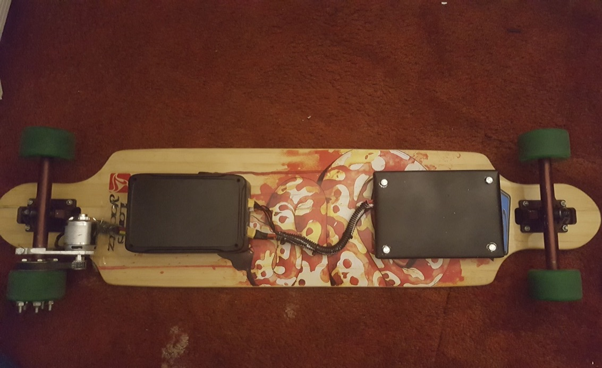

# Electrical Longboard (In Progress)

**An arduino based project that transforms a regular longboard into a electrical longboard.
This project involves using two arduino mini, two HC50 Bluetooth Sets, one ESC and one BLDC motor. One arduino mini works as a master that controls the slave arduino**

## Demo Video:

## Architecture Flow:

## Use:
1. Master file goes into the master arduino (controller)
2. Slave file goes into the slave arduino (longboard)

## RoadMap:
  - [x] 1. Configure design details
  - [x] 2. Implementing the Longboard (CADing, Machining, Prototyping)
  - [x] 3. Connect bluetooth modules
  - [ ] 4. Set up remote controller (master arduino)
  - [ ] 5. Set up longboard (slave arduino)
  - [ ] 6. Test longboard
  - [ ] 7. Fix bugs and improve design

## Dev Tools and core Electrical components:
* **Arduino Mini and HC50 Bluetooth Set** 
* **ESC and BLDC**

## Credits
**The mechanical and electrical work is done by Josh Lee and Steven Kim**

## More details will be updated as the project progresses